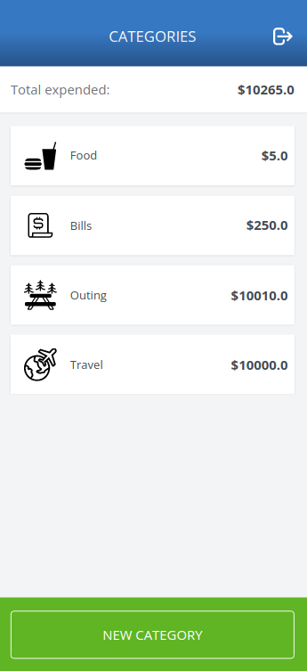

# Budget on Rails

The Ruby on Rails capstone project is about a mobile web application where you can manage your budget: you have a list of transactions associated with a category, so that you can see how much money you spent and on what.

## Built With

- Ruby
- Rails
- Postgresql
- Devise

### [Live Demo Link](https://boiling-everglades-91799.herokuapp.com/)

## Getting Started

**This is an example of how you may give instructions on setting up your project locally.**
**Modify this file to match your project, remove sections that don't apply. For example: delete the testing section if the currect project doesn't require testing.**

To get a local copy up and running follow these simple example steps.

### Prerequisites

- Ruby
- Rails
- Yarn
- Postgresql
- Node.js

### Setup

- Clone this repo
- Cd to folder
- Run `bundle install`
- Run `rails assets:precompile`
- Run `rails db:setup`
- Run `rails server` or `rails s`

### Usage

- To compile assets on change, run: `./bin/dev` to start the server instead of `rails s`.
- Open `localhost:3000` in your web browser.

### Troubleshooting

If you encounter any issues with webpacker, try to run `bundle exec rake webpacker:install`

## Author

👤 **Daniel Jaramillo**

- GitHub: [@d4nielj](https://github.com/d4nielj)
- Twitter: [@d4niel_jm](https://twitter.com/d4niel_jm)
- LinkedIn: [d4nielj](https://linkedin.com/in/d4nielj)

## 🤝 Contributing

Contributions, issues, and feature requests are welcome!

Feel free to check the [issues page](../../issues/).

## Acknowledgements ⭐️

Original design idea by [Gregoire Vella on Behance](https://www.behance.net/gregoirevella).

## Show your support

Give a ⭐️ if you like this project!

## 📝 License

This project is [MIT](./LICENSE) licensed.
